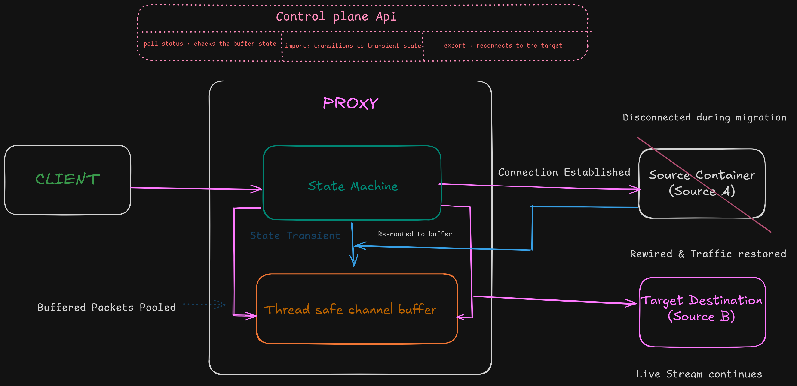
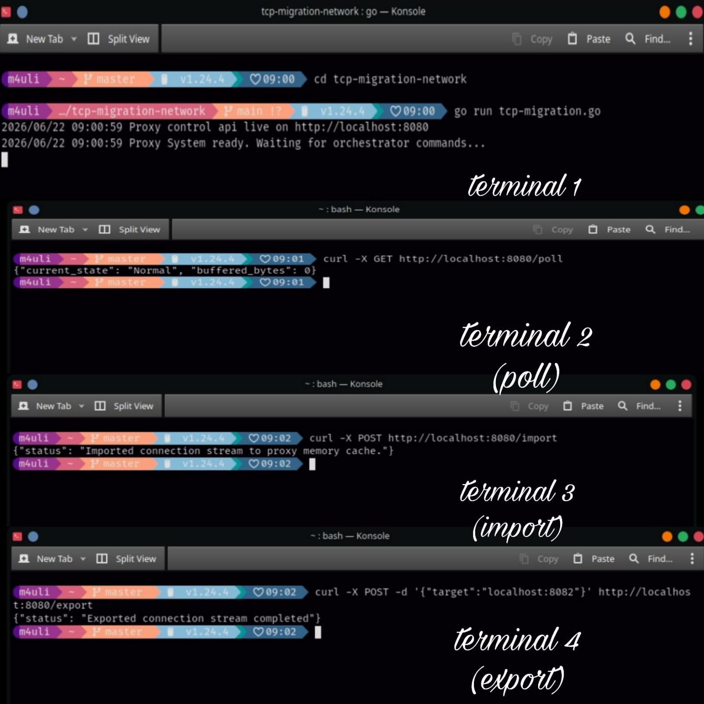

# tcp-migration-network

A headless, state-driven TCP proxy engine in Go designed for zero-downtime container migration. Features robust memory ring-buffering to prevent transient data loss, strict concurrency controls (`sync.Mutex`), and an automated orchestration control plane (`/import`, `/export`, `/poll`) for seamless live backend hot-swapping.

---

## System Architecture

The core proxy operates as a concurrent state machine that dynamically routes live client traffic, switching to a thread-safe channel buffer during runtime container handoffs to prevent active connection dropping.



---

## Control Plane API Verification

The network orchestration layer can be verified sequentially across the active runtime container control plane hooks:



### 1. Status Polling (`GET /poll`)
Checks the active status state machine, monitoring for normal or transient conditions along with active ring-buffer byte counters:
```bash
curl -X GET http://localhost:8080/poll
# Response: {"current_state": "Normal", "buffered_bytes": 0}
# tcp-migration-network

A headless, state-driven TCP proxy engine in Go designed for zero-downtime container migration. Features robust memory ring-buffering to prevent transient data loss, strict concurrency controls (`sync.Mutex`), and an automated orchestration control plane (`/import`, `/export`, `/poll`) for seamless live backend hot-swapping.

---

## Concurrent TCP Proxy Migration Engine

This system is a high-performance, concurrent infrastructure utility engineered in Go to handle seamless live backend handoffs—such as container checkpoint/restore operations using CRIU (Checkpoint/Restore in Userspace)—without edge socket disruption or client-side connection drops.

---

## Foundational Network Principles

### What is TCP/IP?

The Internet Protocol (IP) is the fundamental routing framework of the internet. Its primary responsibility is delivering individual packets of data from a source device to a destination device using assigned IP addresses. IP is intrinsically connectionless and unreliable; it does not guarantee packet ordering, handle duplicate detection, or perform error checking. It functions strictly on a best-effort delivery basis.

To achieve reliable data transmission, IP works in tandem with the Transmission Control Protocol (TCP).

### The Puzzle Analogy

The structural relationship between TCP and IP can be understood through the analogy of mailing a written message on a jigsaw puzzle:

* **IP (The Delivery Truck):** Breaks the puzzle into individual pieces, applies destination addresses, and routes them. Each piece can traverse a completely different physical or logical networking path. Consequently, pieces may arrive out of order, experience latency, or be lost entirely. IP only guarantees delivery attempts to the specified network address.
* **TCP (The Puzzle Assembler):** Sits at the destination endpoint. It receives the out-of-order puzzle pieces, inspects their sequence numbers, and assembles them back into the exact original message. If a piece is missing, TCP signals the sender to re-transmit the dropped segment, issues acknowledgments (ACKs) for verified blocks, and maintains a stateful connection with the sender from session initiation to teardown.

---

## Core Architecture & Component Breakdown


### 1. The Proxy Core

In standard networking configurations, a client establishes a direct socket connection to a backend server. In this architecture, the Proxy functions as an abstraction layer. The client anchors its persistent TCP connection directly to the Proxy, decoupling the client from the physical state, operational lifecycle, or shifting IP addresses of the underlying backend infrastructure.

### 2. The Migration Layer (Control Plane)

The Migration Layer serves as the administrative orchestration plane of the proxy, decoupling the core data-forwarding plane from the management plane. Instead of requiring the proxy to make autonomous decisions regarding backend selection, this layer exposes standardized HTTP interfaces. External container orchestrators or checkpointing utilities (like CRIU) use these hooks to programmatically manipulate the proxy's operational lifecycle during a live migration event.

### 3. The Cache (Thread-Safe Ring Buffer)

During the transient phase of container migration, the target backend server is temporarily frozen or unmapped. To prevent dropping ingress packets and breaking the established client socket, the proxy intercepts the incoming raw TCP byte stream and diverts it into an in-memory Cache.

* **Implementation:** Engineered natively using Go channels or optimized byte slices synchronized via mutual exclusion locks (`sync.Mutex`).
* **Concurrency Safety:** Guarantees absolute thread safety, ensuring highly concurrent read/write network routines do not cause race conditions or memory corruption.
* **Sequence Preservation:** Enforces strict FIFO (First-In, First-Out) packet ordering so the cached stream can be replayed identically to the destination host.

### 4. Graceful Shutdown

The Graceful Shutdown mechanism guarantees that when the proxy transitions states or severs an upstream link, it does not truncate active data flights in transit. It stops accepting new connection requests on the main listener socket, allows active worker routines to finish draining their current queues, and releases system resources—such as file descriptors—to prevent socket leaks and kernel memory exhaustion.

---

## State Machine Protocol (SMP) & Control API

The proxy engine relies on a strict State Machine Protocol (SMP) to safely govern how bytes are routed through the system. The control plane API explicitly manipulates this state machine to execute live hot-swapping:

```text
[STATE_NORMAL] -----( POST /import )-----> [STATE_TRANSIENT] -----( POST /export )-----> [STATE_NORMAL] (Target B)

```

* **`STATE_NORMAL`:** The proxy functions as a transparent, high-throughput tunnel, forwarding streaming data directly from the client socket to the active destination host.
* **`STATE_TRANSIENT`:** The proxy enters an intercept-and-hold sequence. The connection to the active backend is dropped, and all incoming streaming data from the client is buffered directly inside the local memory cache.

### `GET /poll`

The telemetry and monitoring endpoint used by orchestrators to audit the real-time status of the proxy.

* **Action:** Returns the active state machine status (`STATE_NORMAL` vs `STATE_TRANSIENT`), the total count of active edge sockets, and the current byte size of the memory cache queue.

### `POST /import`

The state-transition trigger that prepares the network system for live container migration.

* **Action:** Shifts the proxy state from `STATE_NORMAL` to `STATE_TRANSIENT`. It gracefully decouples the active connection to Source Server A, forcing the proxy to hold the client-side TCP socket open at the edge. It catches incoming payloads and pools them inside the synchronized memory cache while Server A is being checkpointed or moved.

### `POST /export`

The final synchronization and network rewiring hook.

* **Action:** Restores the proxy state back to `STATE_NORMAL` while targeting a new destination host. It establishes a brand-new outbound TCP socket connection to Target Server B. Once the tunnel handshake succeeds, it sequentially flushes the memory cache down into Server B's ingress stream before letting fresh client data pass through directly. This guarantees absolute zero-loss stream continuity.

---

## CLI Execution & Telemetry Logs

Below is the exact terminal behavior and logging output captured across the orchestration lifecycle using standard curl utilities:

### 1. Monitoring Steady State

```bash
$ curl -X GET http://localhost:8080/poll

```

### 2. Initiating Target Decoupling

```bash
$ curl -X POST http://localhost:8080/import

```


### 3. Executing Live Hot-Swap & Buffer Flush

```bash
$ curl -X POST -d '{"target":"localhost:8082"}' http://localhost:8080/export

```

---

## Live Execution Proof (Cluster Environment)

Below is a terminal capture configuration of the proxy engine managing a live container handoff across four isolated execution scopes:

1. **Top-Left (Client):** Piping persistent streaming data without a single socket drop or timeout error.
2. **Top-Right (Control Plane):** Showing sequential orchestration logs for `/import` and `/export` hooks.
3. **Bottom-Left (Proxy Engine):** Executing thread-safe concurrent routines, locking memory state channels, and logging internal timespans.
4. **Bottom-Right (Target Server B):** Successfully spinning up, accepting the rewiring handoff, and swallowing the flushed buffer cache down to the exact byte.


## References & Technical Sources

1. **CRIU (Checkpoint/Restore in Userspace):** The upstream Linux kernel utility used to freeze a running container and checkpoint its state to disk.
2. **TCP Proxy Core Reference:** Broad conceptual patterns adapted from network proxy implementation strategies for address handling.
3. **Dynamic Connection Migration:** Principles derived from established research on session tracking and reliable transparent TCP connection migration layers.
4. **Go Concurrency Patterns:** Utilizing safe memory sharing primitives (`sync.Mutex`, goroutines, and unbuffered/buffered select channels) to eliminate data races during packet buffering.
5. **SockMi Architecture:** Design reference material on alternative systems-level solutions for migrating active TCP/IP connections across network boundaries.
